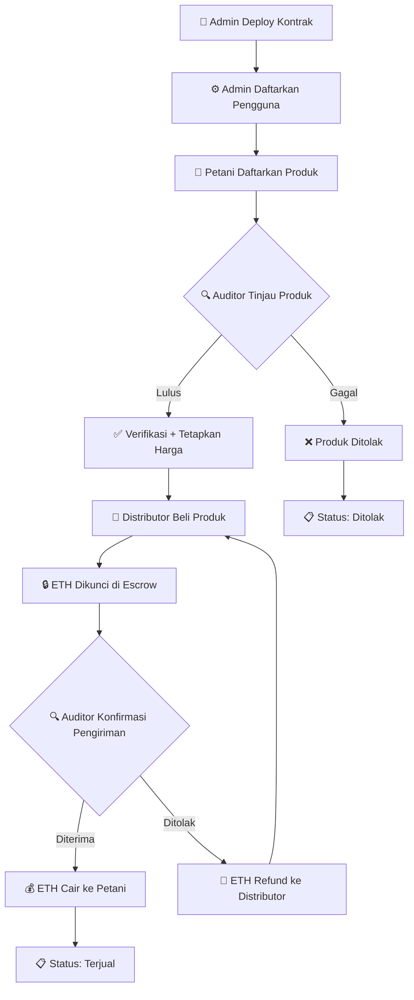
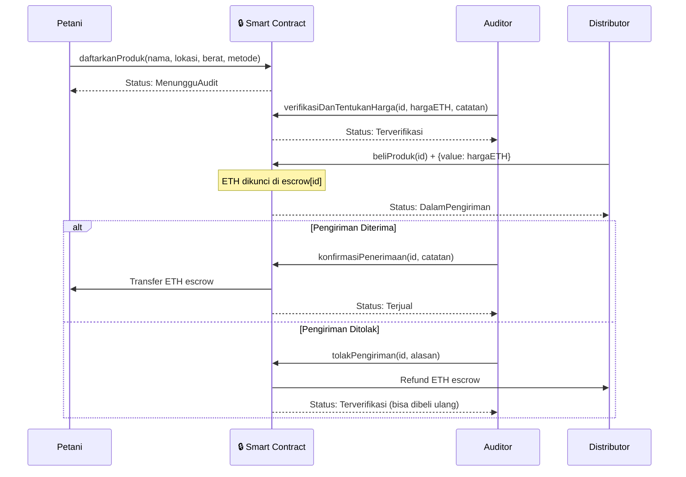

<div align="center">

# 🌾 AgriChain

### *Blockchain-Based Agricultural Supply Chain Platform*

**Escrow ETH & Traceability Produk Pertanian di Atas Jaringan Ethereum**

<br/>

[](.)
[](LICENSE)
[](.)
[-purple?style=for-the-badge)](.)
[](.)
[](.)

</div>

---

## 📋 Document Control

<table>
<tr><th>Atribut</th><th>Detail</th></tr>
<tr><td><b>Versi</b></td><td>1.0.0</td></tr>
<tr><td><b>Tanggal</b></td><td>1 Juni 2026</td></tr>
<tr><td><b>Status</b></td><td>✅ WORKING — Hardhat Local</td></tr>
<tr><td><b>Domain</b></td><td>Agricultural Supply Chain · Web3 · DApp</td></tr>
<tr><td><b>Lisensi</b></td><td>MIT</td></tr>
</table>

---

## 👨‍💻 Tim Pengembang

<table>
<tr>
  <th>#</th>
  <th>Nama</th>
  <th>Role</th>
</tr>
<tr>
  <td>1</td>
  <td>🧑‍💻 <b>Agung Susilo Widodo</b></td>
  <td>Full Stack Blockchain Developer</td>
</tr>
<tr>
  <td>2</td>
  <td>🧑‍💻 <b>Risky Pandu Widianto</b></td>
  <td>Full Stack Blockchain Developer</td>
</tr>
<tr>
  <td>3</td>
  <td>🧑‍💻 <b>Ghairan Rahmad Al Ghani</b></td>
  <td>Full Stack Blockchain Developer</td>
</tr>
</table>

---

## ⚡ Quick Start (Ringkasan)

```bash
# 1. Clone repository
git clone <repo-url>
cd agrichain

# 2. Install dependensi (root + frontend)
npm install
cd frontend && npm install && cd ..
```

**Terminal 1 — Hardhat Node:**
```bash
npx hardhat node
```

**Terminal 2 — Deploy Kontrak:**
```bash
npm run deploy:local
```

**Terminal 3 — Frontend Dev Server:**
```bash
cd frontend && npm run dev
```

**Setup MetaMask (setelah 3 terminal berjalan):**
- Tambah network: **Hardhat Localhost**, RPC `http://127.0.0.1:8545`, Chain ID `31337`
- Import akun-akun di bawah menggunakan private key (lihat [Tabel Akun Hardhat](#tabel-akun-hardhat--private-key-siap-pakai))
- Buka **http://localhost:3000**

> **Tutorial lengkap & troubleshooting** → lihat [Bagian 6](#6--tutorial-lengkap-panduan-replikasi)

---

## 📚 Daftar Isi

<table>
<tr>
<td valign="top">

**Bagian Utama**
- [1. Scope & Overview](#1--scope--overview)
- [2. Technology Stack](#2--technology-stack)
- [3. System Architecture](#3--system-architecture)
- [4. Smart Contract Specification](#4--smart-contract-specification)
- [5. Alur Demo](#5--alur-demo)

</td>
<td valign="top">

**Operasional**
- [6. Tutorial Lengkap (Panduan Replikasi)](#6--tutorial-lengkap-panduan-replikasi)
- [7. Environment Setup (Referensi)](#7--environment-setup-referensi)
- [8. Pengujian](#8--pengujian)
- [9. MVP Scope](#9--mvp-scope)
- [10. Best Practices & Security](#10--best-practices--security)
- [Annex A — References](#annex-a--references)
- [Annex B — Glossary](#annex-b--glossary)

</td>
</tr>
</table>

---

## 1. 🎯 Scope & Overview

### Permasalahan Rantai Pasok Pertanian

Rantai pasok pertanian konvensional di Indonesia dihadapkan pada berbagai masalah struktural: kehadiran tengkulak yang menekan harga di level petani, ketiadaan transparansi dalam penetapan harga, tidak adanya jaminan pembayaran, serta absennya mekanisme traceability yang memungkinkan konsumen atau distributor untuk memverifikasi asal-usul produk.

**AgriChain** hadir sebagai solusi berbasis *smart contract* Ethereum yang menghilangkan perantara tidak efisien, menjamin pembayaran melalui mekanisme escrow, dan merekam seluruh alur produk di blockchain sehingga dapat diaudit oleh siapapun.

### Matriks Permasalahan & Solusi

<table>
<tr>
  <th>ID</th>
  <th>Permasalahan</th>
  <th>Solusi AgriChain</th>
  <th>Implementasi</th>
</tr>
<tr>
  <td><b>P-01</b></td>
  <td>Tengkulak menekan harga petani secara sepihak</td>
  <td>Harga ditetapkan oleh Auditor independen yang berwenang</td>
  <td><code>verifikasiDanTentukanHarga()</code></td>
</tr>
<tr>
  <td><b>P-02</b></td>
  <td>Tidak ada jaminan pembayaran ke petani</td>
  <td>ETH dikunci di escrow saat distributor membeli, hanya cair setelah konfirmasi auditor</td>
  <td><code>beliProduk()</code> + <code>konfirmasiPenerimaan()</code></td>
</tr>
<tr>
  <td><b>P-03</b></td>
  <td>Tidak ada traceability asal-usul produk</td>
  <td>Setiap perubahan status produk direkam dalam riwayat on-chain yang tidak dapat diubah</td>
  <td><code>getRiwayatProduk()</code></td>
</tr>
<tr>
  <td><b>P-04</b></td>
  <td>Produk tidak memenuhi standar masuk distribusi tanpa filter</td>
  <td>Auditor (Dinas Pertanian) memverifikasi dan berhak menolak produk sebelum dijual</td>
  <td><code>tolakProduk()</code></td>
</tr>
</table>

### Value Proposition

| Prinsip | Deskripsi |
|---|---|
| **Transparan** | Semua transaksi, harga, dan riwayat produk tercatat di blockchain dan dapat diverifikasi publik |
| **Trustless** | Escrow otomatis — tidak ada pihak ketiga yang memegang dana; kode kontrak yang mengatur |
| **Traceable** | Riwayat lengkap produk dari pendaftaran petani hingga distribusi akhir tersimpan permanen |

---

## 2. 🛠️ Technology Stack

<table>
<tr>
  <th>Layer</th>
  <th>Teknologi</th>
  <th>Versi</th>
  <th>Justifikasi</th>
</tr>
<tr>
  <td><b>Smart Contract</b></td>
  <td>Solidity + Hardhat</td>
  <td>0.8.20 / ^2.28</td>
  <td>Solidity 0.8.x memiliki built-in overflow protection; Hardhat menyediakan local EVM yang cepat untuk development</td>
</tr>
<tr>
  <td><b>Testing</b></td>
  <td>Hardhat + Chai + hardhat-chai-matchers</td>
  <td>^4.3 / ^2.1</td>
  <td>Framework testing standar industri untuk smart contract, mendukung event assertion dan revert matching</td>
</tr>
<tr>
  <td><b>Frontend</b></td>
  <td>React + Vite</td>
  <td>^18.3 / ^5.3</td>
  <td>Vite memberikan HMR yang sangat cepat; React ekosistem yang mature untuk DApp</td>
</tr>
<tr>
  <td><b>Styling</b></td>
  <td>Tailwind CSS</td>
  <td>^3.4</td>
  <td>Utility-first CSS memungkinkan prototyping UI yang cepat tanpa file CSS terpisah</td>
</tr>
<tr>
  <td><b>Web3 Library</b></td>
  <td>ethers.js</td>
  <td>^6.13</td>
  <td>ethers v6 menggunakan BigInt native, lebih ringan dari web3.js, dan API yang lebih bersih</td>
</tr>
<tr>
  <td><b>Icons</b></td>
  <td>Lucide React</td>
  <td>^0.400</td>
  <td>Icon set yang konsisten dan tree-shakeable</td>
</tr>
<tr>
  <td><b>Wallet</b></td>
  <td>MetaMask</td>
  <td>Latest</td>
  <td>Wallet browser paling populer, mendukung injeksi provider EIP-1193</td>
</tr>
<tr>
  <td><b>Network Default</b></td>
  <td>Hardhat Localhost</td>
  <td>Chain ID 31337</td>
  <td>EVM lokal deterministik, gratis, cepat — ideal untuk development dan demo</td>
</tr>
<tr>
  <td><b>Network Opsional</b></td>
  <td>Sepolia Testnet</td>
  <td>Chain ID 11155111</td>
  <td>Testnet publik Ethereum untuk demo di lingkungan yang lebih realistis</td>
</tr>
</table>

---

## 3. 🏗️ System Architecture

### Struktur Direktori

```
agrichain/
├── 📄 contracts/
│   └── AgriChain.sol          # Smart contract utama (escrow + traceability)
│
├── 🖥️ frontend/
│   ├── package.json
│   └── src/
│       ├── App.jsx             # Root component + setup screen + routing role
│       ├── abi.js              # ABI contract ter-generate
│       ├── constants.js        # ROLE, STATUS, label, warna, konfigurasi network
│       ├── utils.js            # mapProduct(), formatEth(), shortAddr()
│       ├── main.jsx            # Entry point React
│       ├── index.css           # Tailwind directives + custom utility classes
│       │
│       ├── components/
│       │   ├── BalanceCard.jsx         # Kartu saldo ETH + stat card
│       │   ├── ErrorBoundary.jsx       # React error boundary per-dashboard
│       │   ├── Header.jsx              # Navigasi atas + info wallet
│       │   ├── ProductCard.jsx         # Kartu produk dengan aksi kontekstual
│       │   ├── RoleBadge.jsx           # Badge role berwarna
│       │   ├── Spinner.jsx             # Loading spinner
│       │   ├── StatusBadge.jsx         # Badge status produk
│       │   ├── Toast.jsx               # Notifikasi toast
│       │   └── TraceabilityModal.jsx   # Modal riwayat produk lengkap
│       │
│       ├── context/
│       │   └── Web3Context.jsx  # State global: wallet, contract, userInfo, escrow
│       │
│       ├── dashboards/
│       │   ├── AdminDashboard.jsx       # Registrasi pengguna, statistik platform
│       │   ├── AuditorDashboard.jsx     # Verifikasi, tolak produk, konfirmasi escrow
│       │   ├── DistributorDashboard.jsx # Beli produk, lihat escrow aktif
│       │   └── PetaniDashboard.jsx      # Daftarkan produk, lihat status & riwayat
│       │
│       └── pages/
│           └── LandingPage.jsx  # Halaman selamat datang sebelum connect wallet
│
├── 🧪 scripts/
│   ├── deploy.js               # Deploy + setup demo data (5 produk, 6 peserta)
│   ├── run-dev.ps1             # PowerShell script: node + deploy + frontend serentak
│   └── test-full.js            # Integration test script
│
├── 🔬 test/
│   └── AgriChain.test.js      # 53 unit test (Hardhat + Chai)
│
├── hardhat.config.js           # Konfigurasi Solidity + network (localhost, Sepolia)
└── package.json                # Scripts npm: compile, test, node, deploy
```

### Alur Bisnis — Flowchart



### Alur Escrow ETH — Sequence Diagram



---

## 4. 📜 Smart Contract Specification

### Enum Role

<table>
<tr><th>Nilai</th><th>Nama</th><th>Deskripsi</th></tr>
<tr><td><code>0</code></td><td><code>TidakTerdaftar</code></td><td>Default — alamat belum memiliki role apapun</td></tr>
<tr><td><code>1</code></td><td><code>Petani</code></td><td>Dapat mendaftarkan produk pertanian</td></tr>
<tr><td><code>2</code></td><td><code>Auditor</code></td><td>Dapat memverifikasi, menolak, dan mengkonfirmasi pengiriman</td></tr>
<tr><td><code>3</code></td><td><code>Distributor</code></td><td>Dapat membeli produk dengan ETH (trigger escrow)</td></tr>
<tr><td><code>4</code></td><td><code>Admin</code></td><td>Dapat mendaftarkan pengguna baru; ditetapkan otomatis ke deployer</td></tr>
</table>

### Enum Status Produk

<table>
<tr><th>Nilai</th><th>Nama</th><th>Deskripsi</th></tr>
<tr><td><code>0</code></td><td><code>MenungguAudit</code></td><td>Baru didaftarkan oleh petani, menunggu verifikasi auditor</td></tr>
<tr><td><code>1</code></td><td><code>Terverifikasi</code></td><td>Lolos audit, harga ditetapkan, siap dibeli distributor</td></tr>
<tr><td><code>2</code></td><td><code>DalamPengiriman</code></td><td>ETH terkunci di escrow, sedang dalam proses pengiriman</td></tr>
<tr><td><code>3</code></td><td><code>DiDistributor</code></td><td>(Legacy — tidak digunakan dalam alur saat ini)</td></tr>
<tr><td><code>4</code></td><td><code>Terjual</code></td><td>Pengiriman dikonfirmasi, ETH telah dicairkan ke petani</td></tr>
<tr><td><code>5</code></td><td><code>Ditolak</code></td><td>Ditolak oleh auditor (saat verifikasi atau saat pengiriman)</td></tr>
</table>

**Alur Status (ASCII Flow):**

```
[Petani]                  [Auditor]                 [Distributor]
    │                         │                           │
    ▼                         │                           │
MenungguAudit(0) ─── tolak ──► Ditolak(5)                │
    │                         │                           │
    └──── verifikasi ─────────►│                          │
                         Terverifikasi(1) ─── beli ──────►│
                              │                    DalamPengiriman(2)
                              │                           │
                    konfirmasi│                           │
                              ▼                           │
                         Terjual(4)                       │
                         [ETH → Petani]                   │
                              │                           │
                    tolakPengiriman                       │
                              ▼                           │
                         Terverifikasi(1) ◄───────────────┘
                         [ETH → Distributor]
```

### Fungsi Smart Contract

<table>
<tr>
  <th>Fungsi</th>
  <th>Akses</th>
  <th>Deskripsi</th>
</tr>
<tr>
  <td><code>daftarkanPengguna(alamat, nama, role)</code></td>
  <td>Admin</td>
  <td>Mendaftarkan alamat wallet baru dengan nama dan role tertentu</td>
</tr>
<tr>
  <td><code>daftarkanProduk(nama, lokasi, berat, metode)</code></td>
  <td>Petani</td>
  <td>Mendaftarkan produk baru tanpa harga; harga ditetapkan auditor saat verifikasi</td>
</tr>
<tr>
  <td><code>verifikasiDanTentukanHarga(id, hargaFinal, catatan)</code></td>
  <td>Auditor</td>
  <td>Memverifikasi produk <em>sekaligus</em> menetapkan harga jual final dalam Wei</td>
</tr>
<tr>
  <td><code>tolakProduk(id, catatan)</code></td>
  <td>Auditor</td>
  <td>Menolak produk yang belum lolos standar; status menjadi Ditolak, tidak bisa dibeli</td>
</tr>
<tr>
  <td><code>beliProduk(id)</code> <em>payable</em></td>
  <td>Distributor</td>
  <td>Membeli produk; ETH sebesar harga ditetapkan auditor dikunci otomatis di escrow kontrak</td>
</tr>
<tr>
  <td><code>konfirmasiPenerimaan(id, catatan)</code></td>
  <td>Auditor</td>
  <td>Konfirmasi produk diterima; ETH escrow dicairkan ke alamat petani (CEI pattern)</td>
</tr>
<tr>
  <td><code>tolakPengiriman(id, alasan)</code></td>
  <td>Auditor</td>
  <td>Tolak pengiriman; ETH escrow direfund ke distributor; produk kembali ke Terverifikasi</td>
</tr>
<tr>
  <td><code>getPengguna(alamat)</code></td>
  <td>Public (view)</td>
  <td>Membaca struct Pengguna (nama, role, aktif) dari mapping</td>
</tr>
<tr>
  <td><code>getProduk(id)</code></td>
  <td>Public (view)</td>
  <td>Membaca struct Produk (semua field termasuk harga dan auditor penentu harga)</td>
</tr>
<tr>
  <td><code>getRiwayatProduk(id)</code></td>
  <td>Public (view)</td>
  <td>Mengembalikan seluruh array Riwayat produk (waktu, pelaku, status, keterangan)</td>
</tr>
<tr>
  <td><code>getTotalRiwayat(id)</code></td>
  <td>Public (view)</td>
  <td>Mengembalikan jumlah entri riwayat untuk suatu produk</td>
</tr>
<tr>
  <td><code>getEscrow(id)</code></td>
  <td>Public (view)</td>
  <td>Mengembalikan nilai ETH (Wei) yang sedang terkunci di escrow untuk produk tertentu</td>
</tr>
<tr>
  <td><code>getContractBalance()</code></td>
  <td>Public (view)</td>
  <td>Mengembalikan total saldo ETH yang tersimpan di kontrak saat ini</td>
</tr>
</table>

### Source Code — AgriChain.sol

<details>
<summary><b>Klik untuk melihat source code lengkap AgriChain.sol</b></summary>

```solidity
// SPDX-License-Identifier: MIT
pragma solidity ^0.8.20;

contract AgriChain {

    enum Role { TidakTerdaftar, Petani, Auditor, Distributor, Admin }
    enum Status {
        MenungguAudit,   // 0 - Baru didaftarkan, menunggu auditor
        Terverifikasi,   // 1 - Diverifikasi auditor + harga ditetapkan, siap dijual
        DalamPengiriman, // 2 - ETH terkunci di escrow
        DiDistributor,   // 3 - (legacy, tidak digunakan)
        Terjual,         // 4 - ETH dicairkan ke petani
        Ditolak          // 5 - Ditolak auditor
    }

    struct Pengguna {
        string nama;
        Role role;
        bool aktif;
    }

    struct Produk {
        uint256 id;
        string nama;
        string lokasi;
        uint256 berat;
        string metode;
        address petani;
        Status status;
        uint256 hargaFinalAuditor;
        address auditorPenentuHarga;
    }

    struct Riwayat {
        uint256 waktu;
        address pelaku;
        Status status;
        string keterangan;
    }

    address public owner;
    uint256 public totalProduk;
    uint256 public totalPengguna;

    mapping(address => Pengguna) public pengguna;
    mapping(uint256 => Produk) public produk;
    mapping(uint256 => Riwayat[]) public riwayat;
    mapping(uint256 => uint256) public escrow;
    mapping(uint256 => address) public pembeli;

    event PenggunaTerdaftar(address indexed alamat, string nama, Role role);
    event ProdukDidaftarkan(uint256 indexed id, string nama, address indexed petani);
    event ProdukDiverifikasi(uint256 indexed id, address indexed auditor, uint256 harga);
    event ProdukDitolak(uint256 indexed id, address indexed auditor, string catatan);
    event ETHDikunci(uint256 indexed id, address indexed pembeli, uint256 nilai);
    event ETHDicairkan(uint256 indexed id, address indexed petani, uint256 nilai);
    event ETHDiRefund(uint256 indexed id, address indexed pembeli, uint256 nilai);

    modifier hanyaAdmin() {
        require(pengguna[msg.sender].role == Role.Admin, "AgriChain: Hanya admin");
        _;
    }
    modifier hanyaAuditor() {
        require(pengguna[msg.sender].role == Role.Auditor, "AgriChain: Hanya auditor");
        _;
    }
    modifier hanyaPetani() {
        require(pengguna[msg.sender].role == Role.Petani, "AgriChain: Hanya petani terdaftar");
        _;
    }
    modifier hanyaDistributor() {
        require(pengguna[msg.sender].role == Role.Distributor, "AgriChain: Hanya distributor");
        _;
    }

    constructor() {
        owner = msg.sender;
        pengguna[msg.sender] = Pengguna("Admin AgriChain", Role.Admin, true);
        totalPengguna = 1;
    }

    function daftarkanPengguna(address _alamat, string memory _nama, Role _role) public hanyaAdmin {
        require(_alamat != address(0), "AgriChain: Alamat tidak valid");
        require(bytes(_nama).length > 0, "AgriChain: Nama tidak boleh kosong");
        require(pengguna[_alamat].role == Role.TidakTerdaftar, "AgriChain: Sudah terdaftar");
        pengguna[_alamat] = Pengguna(_nama, _role, true);
        totalPengguna++;
        emit PenggunaTerdaftar(_alamat, _nama, _role);
    }

    function daftarkanProduk(
        string memory _nama,
        string memory _lokasi,
        uint256 _berat,
        string memory _metode
    ) public hanyaPetani returns (uint256) {
        require(bytes(_nama).length > 0, "AgriChain: Nama tidak boleh kosong");
        require(_berat > 0, "AgriChain: Berat harus > 0");
        totalProduk++;
        produk[totalProduk] = Produk(
            totalProduk, _nama, _lokasi, _berat, _metode, msg.sender,
            Status.MenungguAudit, 0, address(0)
        );
        riwayat[totalProduk].push(Riwayat(
            block.timestamp, msg.sender, Status.MenungguAudit,
            "Produk didaftarkan, menunggu audit"
        ));
        emit ProdukDidaftarkan(totalProduk, _nama, msg.sender);
        return totalProduk;
    }

    function verifikasiDanTentukanHarga(
        uint256 _id,
        uint256 _hargaFinal,
        string memory _catatan
    ) public hanyaAuditor {
        require(produk[_id].status == Status.MenungguAudit, "AgriChain: Harus berstatus MenungguAudit");
        require(_hargaFinal > 0, "AgriChain: Harga harus > 0");
        produk[_id].hargaFinalAuditor = _hargaFinal;
        produk[_id].auditorPenentuHarga = msg.sender;
        produk[_id].status = Status.Terverifikasi;
        riwayat[_id].push(Riwayat(
            block.timestamp, msg.sender, Status.Terverifikasi,
            bytes(_catatan).length > 0 ? _catatan : "Terverifikasi"
        ));
        emit ProdukDiverifikasi(_id, msg.sender, _hargaFinal);
    }

    function tolakProduk(uint256 _id, string memory _catatan) public hanyaAuditor {
        require(produk[_id].status == Status.MenungguAudit,
            "AgriChain: Harus berstatus MenungguAudit untuk ditolak");
        require(bytes(_catatan).length > 0, "AgriChain: Alasan penolakan tidak boleh kosong");
        produk[_id].status = Status.Ditolak;
        riwayat[_id].push(Riwayat(block.timestamp, msg.sender, Status.Ditolak, _catatan));
        emit ProdukDitolak(_id, msg.sender, _catatan);
    }

    function beliProduk(uint256 _id) public payable hanyaDistributor {
        require(produk[_id].status == Status.Terverifikasi,
            "AgriChain: Produk harus berstatus Terverifikasi");
        require(escrow[_id] == 0, "AgriChain: Sudah ada escrow aktif untuk produk ini");
        require(msg.value == produk[_id].hargaFinalAuditor,
            "AgriChain: Nilai ETH tidak sesuai harga produk");
        escrow[_id] = msg.value;
        pembeli[_id] = msg.sender;
        produk[_id].status = Status.DalamPengiriman;
        riwayat[_id].push(Riwayat(
            block.timestamp, msg.sender, Status.DalamPengiriman,
            "Dibeli - ETH dikunci di escrow"
        ));
        emit ETHDikunci(_id, msg.sender, msg.value);
    }

    function konfirmasiPenerimaan(uint256 _id, string memory _catatan) public hanyaAuditor {
        require(escrow[_id] > 0, "AgriChain: Tidak ada escrow aktif untuk produk ini");
        uint256 nilai = escrow[_id];
        address petaniAddr = produk[_id].petani;
        // CEI: state diubah sebelum transfer ETH
        escrow[_id] = 0;
        produk[_id].status = Status.Terjual;
        riwayat[_id].push(Riwayat(block.timestamp, msg.sender, Status.Terjual, _catatan));
        (bool ok,) = payable(petaniAddr).call{value: nilai}("");
        require(ok, "AgriChain: Transfer ke petani gagal");
        emit ETHDicairkan(_id, petaniAddr, nilai);
    }

    function tolakPengiriman(uint256 _id, string memory _alasan) public hanyaAuditor {
        require(escrow[_id] > 0, "AgriChain: Tidak ada escrow aktif untuk produk ini");
        uint256 nilai = escrow[_id];
        address pembeliAddr = pembeli[_id];
        // CEI: state diubah sebelum transfer ETH
        escrow[_id] = 0;
        produk[_id].status = Status.Terverifikasi;
        riwayat[_id].push(Riwayat(
            block.timestamp, msg.sender, Status.Ditolak,
            string(abi.encodePacked("Pengiriman ditolak: ", _alasan))
        ));
        (bool ok,) = payable(pembeliAddr).call{value: nilai}("");
        require(ok, "AgriChain: Refund ke distributor gagal");
        emit ETHDiRefund(_id, pembeliAddr, nilai);
    }

    function getPengguna(address _alamat) public view returns (Pengguna memory) { return pengguna[_alamat]; }
    function getProduk(uint256 _id) public view returns (Produk memory) { return produk[_id]; }
    function getRiwayatProduk(uint256 _id) public view returns (Riwayat[] memory) { return riwayat[_id]; }
    function getTotalRiwayat(uint256 _id) public view returns (uint256) { return riwayat[_id].length; }
    function getEscrow(uint256 _id) public view returns (uint256) { return escrow[_id]; }
    function getContractBalance() public view returns (uint256) { return address(this).balance; }
}
```

</details>

---

## 5. 🎬 Alur Demo

Panduan langkah demi langkah untuk presentasi AgriChain dari awal hingga ETH cair ke petani.

### Tabel Langkah Demo

<table>
<tr>
  <th>Step</th>
  <th>Akun MetaMask</th>
  <th>Fungsi / Aksi</th>
  <th>Yang Ditunjukkan</th>
</tr>
<tr>
  <td><b>1</b></td>
  <td>Account #0 (Admin)</td>
  <td>Jalankan <code> npx hardhat run scripts/deploy.js --network localhost   </code></td>
  <td>Kontrak ter-deploy, alamat kontrak muncul di terminal; <code>frontend/.env.local</code> otomatis diperbarui</td>
</tr>
<tr>
  <td><b>2</b></td>
  <td>Account #0 (Admin)</td>
  <td>Buka <code>http://localhost:3000</code>, hubungkan wallet Admin</td>
  <td>Admin Dashboard: statistik platform (total produk, pengguna, saldo escrow terkunci)</td>
</tr>
<tr>
  <td><b>3</b></td>
  <td>Account #0 (Admin)</td>
  <td><code>daftarkanPengguna()</code> — daftarkan Account #1 sebagai Petani</td>
  <td>Transaksi on-chain; petani muncul di daftar pengguna terdaftar</td>
</tr>
<tr>
  <td><b>4</b></td>
  <td>Account #0 (Admin)</td>
  <td><code>daftarkanPengguna()</code> — daftarkan Account #2 sebagai Auditor dan Account #3 sebagai Distributor</td>
  <td>Multi-role registration dalam satu session Admin</td>
</tr>
<tr>
  <td><b>5</b></td>
  <td>Account #1 (Petani)</td>
  <td>Switch ke akun Petani, <code>daftarkanProduk()</code></td>
  <td>Petani Dashboard; produk terdaftar dengan status <em>Menunggu Audit</em>; harga belum ditetapkan</td>
</tr>
<tr>
  <td><b>6</b></td>
  <td>Account #2 (Auditor)</td>
  <td>Switch ke akun Auditor, <code>verifikasiDanTentukanHarga()</code></td>
  <td>Auditor menetapkan harga; produk berubah status ke <em>Terverifikasi</em>; riwayat bertambah</td>
</tr>
<tr>
  <td><b>7</b></td>
  <td>Account #3 (Distributor)</td>
  <td>Switch ke akun Distributor, <code>beliProduk()</code> + kirim ETH tepat senilai harga</td>
  <td>ETH terkunci di kontrak; saldo Distributor berkurang; status produk menjadi <em>Dalam Pengiriman</em></td>
</tr>
<tr>
  <td><b>8</b></td>
  <td>Account #2 (Auditor)</td>
  <td>Switch ke akun Auditor, <code>konfirmasiPenerimaan()</code></td>
  <td>ETH otomatis cair ke alamat Petani; status menjadi <em>Terjual</em>; saldo Petani bertambah</td>
</tr>
<tr>
  <td><b>9</b></td>
  <td>Account #1 (Petani)</td>
  <td>Buka modal riwayat produk</td>
  <td>Traceability lengkap: 4 entri on-chain (Petani → Auditor → Distributor → Auditor)</td>
</tr>
<tr>
  <td><b>10</b></td>
  <td>Account #2 (Auditor)</td>
  <td><em>(Bonus)</em> Produk lain — <code>tolakPengiriman()</code></td>
  <td>Skenario refund: ETH kembali ke Distributor, produk kembali ke status Terverifikasi</td>
</tr>
</table>

### Tips Presentasi

> **Screenshot balance sebelum dan sesudah** di MetaMask untuk Step 7 dan Step 8. Ini adalah momen paling impresif — ETH berpindah secara otomatis melalui smart contract tanpa perantara manusia.

---

## 6. 📖 Tutorial Lengkap (Panduan Replikasi)

> Bagian ini ditujukan untuk kelompok lain yang ingin menjalankan AgriChain dari awal di laptop masing-masing. Ikuti setiap langkah secara berurutan.

---

### Langkah 1 — Persiapan Software

Pastikan semua software berikut sudah terinstall sebelum memulai:

<table>
<tr><th>Software</th><th>Versi Minimum</th><th>Cara Cek</th><th>Link Download</th></tr>
<tr><td><b>Node.js</b></td><td>v18.0+</td><td><code>node --version</code></td><td>https://nodejs.org (pilih LTS)</td></tr>
<tr><td><b>npm</b></td><td>v9.0+</td><td><code>npm --version</code></td><td>Sudah termasuk di Node.js</td></tr>
<tr><td><b>Git</b></td><td>v2.0+</td><td><code>git --version</code></td><td>https://git-scm.com</td></tr>
<tr><td><b>MetaMask</b></td><td>Terbaru</td><td>Cek di browser extensions</td><td>https://metamask.io (pilih ekstensi Chrome/Firefox)</td></tr>
<tr><td><b>Browser</b></td><td>Chrome / Firefox / Brave</td><td>—</td><td>—</td></tr>
</table>

> **Catatan:** MetaMask harus diinstall sebagai ekstensi browser, bukan aplikasi desktop.

---

### Langkah 2 — Clone & Install Dependensi

Buka terminal (Command Prompt / PowerShell / Git Bash), lalu jalankan:

```bash
# Clone repository
git clone <url-repository-agrichain>
cd agrichain

# Install dependensi root (Hardhat, ethers, dll.)
npm install

# Install dependensi frontend (React, Vite, Tailwind, dll.)
cd frontend
npm install
cd ..
```

Pastikan tidak ada error merah. Warning kuning bisa diabaikan.

---

### Langkah 3 — Setup MetaMask

#### 3a. Buat atau Buka MetaMask

Jika belum punya akun MetaMask, buat baru dan simpan seed phrase dengan aman. Jika sudah punya, buka MetaMask di browser.

#### 3b. Tambah Network Hardhat Localhost

1. Buka MetaMask → klik nama network di pojok kiri atas (biasanya tertulis "Ethereum Mainnet")
2. Klik **"Add network"** → **"Add a network manually"**
3. Isi form dengan data berikut:

<table>
<tr><th>Field</th><th>Nilai yang Diisi</th></tr>
<tr><td><b>Network name</b></td><td><code>Hardhat Localhost</code></td></tr>
<tr><td><b>New RPC URL</b></td><td><code>http://127.0.0.1:8545</code></td></tr>
<tr><td><b>Chain ID</b></td><td><code>31337</code></td></tr>
<tr><td><b>Currency symbol</b></td><td><code>ETH</code></td></tr>
<tr><td><b>Block explorer URL</b></td><td>(kosongkan)</td></tr>
</table>

4. Klik **Save** → MetaMask akan otomatis pindah ke network Hardhat Localhost

> **Penting:** Network ini hanya aktif saat Hardhat Node sedang berjalan (Langkah 4). Jika Hardhat Node dimatikan, koneksi akan gagal — ini normal.

#### 3c. Import Akun Hardhat ke MetaMask

Akun-akun Hardhat bersifat **deterministik** — private key-nya selalu sama di semua laptop, sehingga bisa langsung di-copas dari tabel di bawah.

> ⚠️ **Akun-akun ini HANYA untuk keperluan development/demo lokal. Jangan gunakan private key ini untuk menyimpan aset nyata.**

##### Tabel Akun Hardhat — Private Key Siap Pakai

<table>
<tr>
  <th>#</th>
  <th>Role dalam Demo</th>
  <th>Nama dalam Aplikasi</th>
  <th>Address</th>
  <th>Private Key</th>
</tr>
<tr>
  <td><b>0</b></td>
  <td>⚙️ Admin</td>
  <td>Admin AgriChain</td>
  <td><code>0xf39Fd6e51aad88F6F4ce6aB8827279cffFb92266</code></td>
  <td><code>0xac0974bec39a17e36ba4a6b4d238ff944bacb478cbed5efcae784d7bf4f2ff80</code></td>
</tr>
<tr>
  <td><b>1</b></td>
  <td>🌾 Petani 1</td>
  <td>Pak Budi Santoso</td>
  <td><code>0x70997970C51812dc3A010C7d01b50e0d17dc79C8</code></td>
  <td><code>0x59c6995e998f97a5a0044966f0945389dc9e86dae88c7a8412f4603b6b78690d</code></td>
</tr>
<tr>
  <td><b>2</b></td>
  <td>🔍 Auditor</td>
  <td>Dinas Pertanian Malang</td>
  <td><code>0x3C44CdDdB6a900fa2b585dd299e03d12FA4293BC</code></td>
  <td><code>0x5de4111afa1a4b94908f83103eb1f1706367c2e68ca870fc3fb9a804cdab365a</code></td>
</tr>
<tr>
  <td><b>3</b></td>
  <td>🚛 Distributor 1</td>
  <td>PT Agro Nusantara</td>
  <td><code>0x90F79bf6EB2c4f870365E785982E1f101E93b906</code></td>
  <td><code>0x7c852118294e51e653712a81e05800f419141751be58f605c371e15141b007a6</code></td>
</tr>
<tr>
  <td><b>4</b></td>
  <td>🌾 Petani 2</td>
  <td>Bu Sri Wahyuni</td>
  <td><code>0x15d34AAf54267DB7D7c367839AAf71A00a2C6A65</code></td>
  <td><code>0x47e179ec197488593b187f80a00eb0da91f1b9d0b13f8733639f19c30a34926b</code></td>
</tr>
<tr>
  <td><b>5</b></td>
  <td>🚛 Distributor 2</td>
  <td>CV Berkah Pangan</td>
  <td><code>0x9965507D1a55bcC2695C58ba16FB37d819B0A4dc</code></td>
  <td><code>0x8b3a350cf5c34c9194ca85829a2df0ec3153be0318b5e2d3348e872092edffba</code></td>
</tr>
</table>

##### Cara Import Akun ke MetaMask (per akun):

1. Buka MetaMask → klik ikon lingkaran akun di pojok kanan atas
2. Pilih **"Add account or hardware wallet"**
3. Pilih **"Import account"**
4. Pilih **"Private Key"** pada dropdown Type
5. Paste private key dari tabel di atas (dengan atau tanpa awalan `0x`)
6. Klik **Import**
7. Ulangi untuk semua 6 akun

Setelah import, MetaMask akan menampilkan akun dengan nama default seperti "Account 2", "Account 3", dst. Anda bisa rename masing-masing akun agar lebih mudah dikenali:
- Klik titik tiga `⋮` di samping nama akun → **"Edit account"** → ubah nama sesuai rolenya

---

### Langkah 4 — Jalankan Hardhat Node

Buka **Terminal 1** (jangan ditutup selama menggunakan aplikasi):

```bash
npx hardhat node
```

Output yang muncul akan seperti ini:

```
Started HTTP and WebSocket JSON-RPC server at http://127.0.0.1:8545/

Accounts
========
Account #0: 0xf39Fd6e51aad88F6F4ce6aB8827279cffFb92266 (10000 ETH)
Private Key: 0xac0974bec39a17e36ba4a6b4d238ff944bacb478cbed5efcae784d7bf4f2ff80

Account #1: 0x70997970C51812dc3A010C7d01b50e0d17dc79C8 (10000 ETH)
Private Key: 0x59c6995e998f97a5a0044966f0945389dc9e86dae88c7a8412f4603b6b78690d
...
```

> **Biarkan terminal ini tetap terbuka.** Hardhat Node adalah blockchain lokal yang harus terus berjalan.

---

### Langkah 5 — Deploy Smart Contract

Buka **Terminal 2** (baru, jangan tutup Terminal 1):

```bash
npm run deploy:local
```

Output yang muncul:

```
=====================================================
  AgriChain — Deploy & Demo
=====================================================

Deployer (Admin) : 0xf39Fd6e51aad88F6F4ce6aB8827279cffFb92266
Balance Admin    : 10000.0 ETH

Deploying AgriChain...
Contract deployed: 0x5FbDB2315678afecb367f032d93F642f64180aa3

--- 1. Registrasi Peserta Blockchain ---
  ┌─────────────────────┬──────────────────────────────┬────────────────────────────────────────────┐
  │ Role                │ Nama                         │ Address                                    │
  ├─────────────────────┼──────────────────────────────┼────────────────────────────────────────────┤
  │ Admin (Owner)       │ Admin AgriChain              │ 0xf39Fd6e51aad88F6F4ce6aB8827279cffFb92266 │
  │ Petani              │ Pak Budi Santoso             │ 0x70997970C51812dc3A010C7d01b50e0d17dc79C8 │
  │ Auditor             │ Dinas Pertanian Malang       │ 0x3C44CdDdB6a900fa2b585dd299e03d12FA4293BC │
  │ Distributor         │ PT Agro Nusantara            │ 0x90F79bf6EB2c4f870365E785982E1f101E93b906 │
  │ Petani              │ Bu Sri Wahyuni               │ 0x15d34AAf54267DB7D7c367839AAf71A00a2C6A65 │
  │ Distributor         │ CV Berkah Pangan             │ 0x9965507D1a55bcC2695C58ba16FB37d819B0A4dc │
  └─────────────────────┴──────────────────────────────┴────────────────────────────────────────────┘

...

Contract Address   : 0x5FbDB2315678afecb367f032d93F642f64180aa3

frontend/.env.local diperbarui: .../frontend/.env.local
```

> **Catatan penting:** Contract Address yang muncul di terminal Anda mungkin berbeda dari contoh di atas — itu normal. Yang penting adalah file `frontend/.env.local` **otomatis diperbarui** dengan address yang benar.

---

### Langkah 6 — Jalankan Frontend

Buka **Terminal 3** (baru):

```bash
cd frontend
npm run dev
```

Output:

```
  VITE v5.x.x  ready in xxx ms

  ➜  Local:   http://localhost:3000/
  ➜  Network: use --host to expose
```

Buka browser dan akses **http://localhost:3000**

---

### Langkah 7 — Penggunaan Aplikasi per Role

#### 7a. Masuk sebagai Admin

1. Di MetaMask, pilih **Account #0** (Admin AgriChain)
2. Pastikan network aktif adalah **Hardhat Localhost**
3. Di halaman http://localhost:3000, klik **"Connect Wallet"**
4. MetaMask akan meminta konfirmasi koneksi → klik **Connect**
5. Aplikasi otomatis mendeteksi role Admin dan menampilkan **Admin Dashboard**

**Yang bisa dilakukan Admin:**
- Melihat statistik platform (total produk, pengguna terdaftar, total escrow)
- Mendaftarkan pengguna baru dengan mengisi:
  - **Alamat Wallet** — address Ethereum akun yang ingin didaftarkan
  - **Nama** — nama pengguna/perusahaan
  - **Role** — pilih Petani, Auditor, atau Distributor
- Klik **"Daftarkan"** → MetaMask akan muncul untuk konfirmasi transaksi → klik **Confirm**

> **Catatan:** Saat menjalankan `npm run deploy:local`, semua 6 akun sudah otomatis terdaftar oleh script. Admin tidak perlu mendaftarkan ulang.

---

#### 7b. Masuk sebagai Petani

1. Di MetaMask, switch ke **Account #1** (Pak Budi Santoso) atau **Account #4** (Bu Sri Wahyuni)
2. Refresh halaman jika perlu, atau tunggu aplikasi mendeteksi perubahan akun
3. Aplikasi akan menampilkan **Petani Dashboard**

**Cara mendaftarkan produk baru:**
1. Di Petani Dashboard, klik tombol **"Daftarkan Produk"** atau **"Tambah Produk"**
2. Isi form:
   - **Nama Produk** — contoh: `Beras Organik Premium`
   - **Lokasi** — contoh: `Sumbermanjing Wetan, Malang`
   - **Berat (kg)** — contoh: `500`
   - **Metode Tanam** — contoh: `Organik - Tanpa Pestisida`
3. Klik **"Daftarkan"** → konfirmasi di MetaMask → klik **Confirm**
4. Produk muncul di daftar dengan status **"Menunggu Audit"** dan harga belum ditetapkan

**Yang bisa dilihat Petani:**
- Daftar semua produk miliknya beserta status terkini
- Riwayat lengkap setiap produk (klik tombol riwayat/detail)
- Saldo ETH di wallet (bertambah saat escrow cair)

---

#### 7c. Masuk sebagai Auditor

1. Di MetaMask, switch ke **Account #2** (Dinas Pertanian Malang)
2. Aplikasi akan menampilkan **Auditor Dashboard**

**Cara verifikasi produk dan tetapkan harga:**
1. Di Auditor Dashboard, lihat daftar produk berstatus **"Menunggu Audit"**
2. Klik tombol **"Verifikasi"** pada produk yang ingin diverifikasi
3. Isi form verifikasi:
   - **Harga (ETH)** — contoh: `0.05` (ini adalah harga jual yang harus dibayar distributor)
   - **Catatan** — contoh: `Lulus uji lab - bebas residu pestisida`
4. Klik **"Verifikasi & Tetapkan Harga"** → konfirmasi di MetaMask → klik **Confirm**
5. Status produk berubah menjadi **"Terverifikasi"** dengan harga yang sudah ditetapkan

**Cara menolak produk:**
1. Klik tombol **"Tolak"** pada produk yang tidak lolos standar
2. Isi alasan penolakan — contoh: `Ditemukan residu pestisida kelas B`
3. Klik **"Tolak Produk"** → konfirmasi di MetaMask → klik **Confirm**
4. Status produk berubah menjadi **"Ditolak"** — produk ini tidak bisa dibeli

**Cara konfirmasi penerimaan produk (setelah distributor membeli):**
1. Lihat daftar produk berstatus **"Dalam Pengiriman"**
2. Klik tombol **"Konfirmasi Penerimaan"**
3. Isi catatan — contoh: `Diterima dalam kondisi baik di gudang Surabaya`
4. Klik **"Konfirmasi"** → konfirmasi di MetaMask → klik **Confirm**
5. ETH escrow otomatis cair ke wallet petani; status menjadi **"Terjual"**

**Cara menolak pengiriman (refund ke distributor):**
1. Lihat daftar produk berstatus **"Dalam Pengiriman"**
2. Klik tombol **"Tolak Pengiriman"**
3. Isi alasan — contoh: `Kualitas tidak sesuai saat diterima`
4. Klik **"Tolak Pengiriman"** → konfirmasi di MetaMask → klik **Confirm**
5. ETH dikembalikan ke distributor; status produk kembali ke **"Terverifikasi"** (bisa dibeli lagi)

---

#### 7d. Masuk sebagai Distributor

1. Di MetaMask, switch ke **Account #3** (PT Agro Nusantara) atau **Account #5** (CV Berkah Pangan)
2. Aplikasi akan menampilkan **Distributor Dashboard**

**Cara membeli produk:**
1. Di Distributor Dashboard, lihat daftar produk berstatus **"Terverifikasi"**
2. Perhatikan harga yang tertera (ditetapkan oleh auditor)
3. Klik tombol **"Beli Produk"**
4. MetaMask akan muncul dengan nilai ETH yang sudah terisi otomatis sesuai harga produk
5. Pastikan saldo ETH di wallet cukup
6. Klik **Confirm** di MetaMask
7. Status produk berubah menjadi **"Dalam Pengiriman"**; ETH terkunci di escrow smart contract

**Yang bisa dilihat Distributor:**
- Daftar produk yang tersedia untuk dibeli (status Terverifikasi)
- Produk yang sedang dalam pengiriman (escrow aktif)
- Riwayat pembelian

---

### Langkah 8 — Melihat Riwayat Produk (Traceability)

Setiap pengguna (semua role) dapat melihat riwayat lengkap suatu produk:

1. Pada kartu produk manapun, klik tombol **"Riwayat"** atau **"Detail"** (ikon jam / daftar)
2. Modal akan terbuka menampilkan timeline lengkap:
   - Waktu setiap kejadian
   - Siapa pelakunya (address wallet)
   - Status produk saat itu
   - Keterangan/catatan

Contoh riwayat produk yang lengkap (4 langkah):
```
[1] MenungguAudit  — Produk didaftarkan, menunggu audit         (oleh: Petani)
[2] Terverifikasi  — Lulus uji lab - bebas residu pestisida     (oleh: Auditor)
[3] DalamPengiriman— Dibeli - ETH dikunci di escrow             (oleh: Distributor)
[4] Terjual        — Diterima dalam kondisi baik di gudang      (oleh: Auditor)
```

---

### Langkah 9 — Reset & Mulai Ulang (jika diperlukan)

Jika ingin membersihkan semua data dan mulai dari awal:

1. Hentikan semua terminal (Ctrl+C di masing-masing terminal)
2. Jalankan ulang dari **Langkah 4** (Terminal 1: `npx hardhat node`)
3. Jalankan ulang **Langkah 5** (Terminal 2: `npm run deploy:local`)
4. Di MetaMask, **reset akun** untuk menghapus nonce cache:
   - Buka MetaMask → Settings → Advanced → **"Clear activity and nonce data"**
   - Lakukan untuk setiap akun yang digunakan
5. Jalankan ulang frontend (Terminal 3)

> **Mengapa perlu reset MetaMask?** Saat Hardhat Node direstart, blockchain dimulai dari blok 0. MetaMask menyimpan nonce transaksi lama yang menyebabkan transaksi baru gagal jika tidak direset.

---

### Troubleshooting — Masalah Umum

<table>
<tr>
  <th>Masalah</th>
  <th>Penyebab</th>
  <th>Solusi</th>
</tr>
<tr>
  <td><b>Halaman kosong / "Contract not found"</b></td>
  <td>File <code>frontend/.env.local</code> belum ada atau address kontrak salah</td>
  <td>Jalankan ulang <code>npm run deploy:local</code> — file akan diperbarui otomatis</td>
</tr>
<tr>
  <td><b>MetaMask tidak muncul saat klik tombol</b></td>
  <td>Ekstensi MetaMask tidak terdeteksi</td>
  <td>Pastikan MetaMask terinstall dan tidak di-disable di browser. Coba refresh halaman</td>
</tr>
<tr>
  <td><b>"Nonce too high" atau transaksi pending terus</b></td>
  <td>Hardhat Node direstart, nonce MetaMask tidak sinkron</td>
  <td>MetaMask → Settings → Advanced → "Clear activity and nonce data" untuk akun tersebut</td>
</tr>
<tr>
  <td><b>"Wrong network" atau tombol merah di header</b></td>
  <td>MetaMask terhubung ke network selain Hardhat Localhost</td>
  <td>Switch network di MetaMask ke "Hardhat Localhost" (Chain ID 31337)</td>
</tr>
<tr>
  <td><b>"Pengguna tidak terdaftar" di dashboard</b></td>
  <td>Akun yang digunakan belum terdaftar di kontrak</td>
  <td>Pastikan menggunakan salah satu dari 6 akun di tabel. Jika deploy ulang, jalankan <code>npm run deploy:local</code> lagi</td>
</tr>
<tr>
  <td><b>Error "insufficient funds"</b></td>
  <td>Saldo ETH di akun habis</td>
  <td>Ini tidak mungkin terjadi untuk akun Hardhat (#0–#5) karena masing-masing punya 10.000 ETH. Pastikan menggunakan private key yang benar</td>
</tr>
<tr>
  <td><b>Frontend tidak bisa connect ke RPC</b></td>
  <td>Hardhat Node belum dijalankan atau sudah mati</td>
  <td>Pastikan Terminal 1 (<code>npx hardhat node</code>) masih berjalan</td>
</tr>
<tr>
  <td><b><code>npm install</code> gagal</b></td>
  <td>Versi Node.js terlalu lama</td>
  <td>Update Node.js ke versi 18+ dari nodejs.org</td>
</tr>
</table>

---

## 7. ⚙️ Environment Setup (Referensi)

### Prerequisites

<table>
<tr><th>Software</th><th>Versi Minimum</th><th>Cek Versi</th><th>Download</th></tr>
<tr><td>Node.js</td><td>v18.0+</td><td><code>node --version</code></td><td>nodejs.org</td></tr>
<tr><td>npm</td><td>v9.0+</td><td><code>npm --version</code></td><td>Bundled with Node.js</td></tr>
<tr><td>MetaMask</td><td>Latest</td><td>Browser extension</td><td>metamask.io</td></tr>
<tr><td>Git</td><td>v2.0+</td><td><code>git --version</code></td><td>git-scm.com</td></tr>
</table>

### Scripts npm yang Tersedia

```bash
# Compile smart contract
npm run compile

# Jalankan unit test (53 test)
npm test

# Jalankan Hardhat local node
npx hardhat node

# Deploy ke Hardhat localhost (sekaligus update frontend/.env.local)
npm run deploy:local

# Deploy ke Sepolia testnet (butuh .env dengan SEPOLIA_RPC_URL & PRIVATE_KEY)
npm run deploy:sepolia
```

### Environment Variables

**Root — `.env` (untuk deploy Sepolia, opsional):**
```env
SEPOLIA_RPC_URL=https://sepolia.infura.io/v3/YOUR_PROJECT_ID
PRIVATE_KEY=your_private_key_without_0x_prefix
ETHERSCAN_API_KEY=your_etherscan_api_key
```

**Frontend — `frontend/.env.local` (otomatis diperbarui oleh `npm run deploy:local`):**
```env
VITE_CONTRACT_ADDRESS=0x5FbDB2315678afecb367f032d93F642f64180aa3
```

> **Catatan:** File `.env` dan `frontend/.env.local` sudah ada di `.gitignore`. Jangan commit file ini ke repository.

### Deploy ke Sepolia Testnet (Opsional)

```bash
# Pastikan .env sudah diisi dengan SEPOLIA_RPC_URL dan PRIVATE_KEY
npm run deploy:sepolia

# Verifikasi source code di Etherscan Sepolia (opsional)
npm run verify:sepolia <CONTRACT_ADDRESS>
```

---

## 8. 🧪 Pengujian

### Menjalankan Test

```bash
# Unit test (Hardhat + Chai)
npm test

# Semua test sekaligus (unit + integration)
npm run test:all
```

### Hasil Pengujian

> ✅ **53 test cases** — semua passed, 0 gagal

### Test Suite Summary

<table>
<tr>
  <th>Suite</th>
  <th>Jumlah Test</th>
  <th>Status</th>
</tr>
<tr><td>1. Deployment</td><td>3</td><td>✅ Passed</td></tr>
<tr><td>2. Manajemen Pengguna</td><td>6</td><td>✅ Passed</td></tr>
<tr><td>3. Pendaftaran Produk</td><td>8</td><td>✅ Passed</td></tr>
<tr><td>4. Verifikasi + Penetapan Harga</td><td>7</td><td>✅ Passed</td></tr>
<tr><td>5. Tolak Verifikasi</td><td>6</td><td>✅ Passed</td></tr>
<tr><td>6. Escrow — Pembelian</td><td>8</td><td>✅ Passed</td></tr>
<tr><td>7. Escrow — Konfirmasi Penerimaan</td><td>5</td><td>✅ Passed</td></tr>
<tr><td>8. Escrow — Tolak Pengiriman</td><td>5</td><td>✅ Passed</td></tr>
<tr><td>9. Traceability</td><td>5</td><td>✅ Passed</td></tr>
<tr><td><b>Total</b></td><td><b>53</b></td><td>✅ <b>All Passed</b></td></tr>
</table>

---

## 9. 📦 MVP Scope

### Priority Matrix

<table>
<tr>
  <th>✅ MUST HAVE</th>
  <th>⭐ NICE TO HAVE</th>
  <th>❌ OUT OF SCOPE</th>
</tr>
<tr>
<td valign="top">

- Registrasi pengguna oleh Admin
- Pendaftaran produk oleh Petani
- Verifikasi + penetapan harga oleh Auditor
- Penolakan produk saat audit
- Pembelian produk + lock ETH ke escrow
- Konfirmasi pengiriman + cair ETH ke Petani
- Tolak pengiriman + refund ETH ke Distributor
- Riwayat produk on-chain (traceability)
- Dashboard berbeda per role
- Frontend terhubung ke MetaMask (EIP-1193)

</td>
<td valign="top">

- Deploy ke Sepolia Testnet
- QR Code untuk traceability produk
- Filter & search produk
- Notifikasi real-time via event listener
- Paginasi daftar produk
- Statistik escrow di Admin Dashboard
- Export riwayat produk ke CSV

</td>
<td valign="top">

- Integrasi oracle harga (Chainlink)
- Token ERC-20 sebagai mata uang
- NFT sertifikat produk
- Multi-signature escrow
- DAO governance auditor
- Mobile app native
- IPFS untuk foto produk
- Layer 2 scaling (Polygon, Arbitrum)

</td>
</tr>
</table>

### Acceptance Criteria

<table>
<tr>
  <th>Kriteria</th>
  <th>Severity</th>
  <th>Status</th>
</tr>
<tr><td>Admin dapat mendaftarkan pengguna dengan role yang benar</td><td>Critical</td><td>✅ Done</td></tr>
<tr><td>Non-admin tidak dapat mendaftarkan pengguna (revert)</td><td>Critical</td><td>✅ Done</td></tr>
<tr><td>Petani dapat mendaftarkan produk tanpa harga awal</td><td>Critical</td><td>✅ Done</td></tr>
<tr><td>Auditor menetapkan harga saat verifikasi (bukan petani)</td><td>Critical</td><td>✅ Done</td></tr>
<tr><td>ETH terkunci di kontrak saat distributor membeli</td><td>Critical</td><td>✅ Done</td></tr>
<tr><td>ETH cair ke petani setelah konfirmasi auditor</td><td>Critical</td><td>✅ Done</td></tr>
<tr><td>ETH direfund ke distributor saat tolak pengiriman</td><td>Critical</td><td>✅ Done</td></tr>
<tr><td>Produk yang ditolak tidak dapat dibeli</td><td>Critical</td><td>✅ Done</td></tr>
<tr><td>Nilai ETH yang tidak tepat ditolak (revert)</td><td>Critical</td><td>✅ Done</td></tr>
<tr><td>Riwayat produk tersimpan on-chain dan dapat dibaca</td><td>High</td><td>✅ Done</td></tr>
<tr><td>Frontend menampilkan dashboard sesuai role wallet</td><td>High</td><td>✅ Done</td></tr>
<tr><td>Frontend otomatis switch ke Hardhat Localhost saat connect</td><td>High</td><td>✅ Done</td></tr>
<tr><td>Deteksi restart Hardhat node dan disconnect otomatis</td><td>Medium</td><td>✅ Done</td></tr>
<tr><td>Error message informatif saat ABI mismatch</td><td>Medium</td><td>✅ Done</td></tr>
</table>

---

## 10. 🔒 Best Practices & Security

### Security Notes

<table>
<tr>
  <th>Aspek</th>
  <th>Implementasi</th>
</tr>
<tr>
  <td><b>CEI Pattern</b></td>
  <td>Fungsi <code>konfirmasiPenerimaan()</code> dan <code>tolakPengiriman()</code> mengikuti pola <em>Checks-Effects-Interactions</em>: validasi → ubah state → transfer ETH. Ini mencegah reentrancy attack.</td>
</tr>
<tr>
  <td><b>Role-based Access Control</b></td>
  <td>Setiap fungsi kritis dilindungi modifier: <code>hanyaAdmin</code>, <code>hanyaAuditor</code>, <code>hanyaPetani</code>, <code>hanyaDistributor</code>. Tidak ada fallback role.</td>
</tr>
<tr>
  <td><b>Input Validation</b></td>
  <td>Semua parameter divalidasi: zero address ditolak, nama kosong ditolak, berat harus > 0, harga harus > 0, nilai ETH harus tepat sama dengan harga yang ditetapkan auditor.</td>
</tr>
<tr>
  <td><b>Overflow Protection</b></td>
  <td>Solidity 0.8.x memiliki built-in overflow/underflow protection — tidak perlu SafeMath library.</td>
</tr>
<tr>
  <td><b>ETH Transfer</b></td>
  <td>Menggunakan <code>.call{value: ...}("")</code> dengan cek return value — lebih aman dibanding <code>.transfer()</code> yang memiliki gas limit 2300 yang tidak fleksibel.</td>
</tr>
<tr>
  <td><b>Private Key & .env</b></td>
  <td><b>JANGAN commit file <code>.env</code> ke repository.</b> File ini sudah ada di <code>.gitignore</code>. Gunakan hanya private key akun Hardhat test untuk development lokal.</td>
</tr>
<tr>
  <td><b>Escrow Isolation</b></td>
  <td>Setiap produk memiliki escrow independen (<code>mapping(uint256 =&gt; uint256) public escrow</code>). Satu produk tidak dapat mengambil dana escrow produk lain.</td>
</tr>
</table>

### CEI Pattern — Penjelasan Singkat

```
┌─────────────────────────────────────────────────────────────────┐
│  CEI = Checks → Effects → Interactions                          │
│                                                                  │
│  1. CHECKS      — Validasi semua kondisi (require/revert)        │
│  2. EFFECTS     — Update state storage (escrow=0, status, dll.) │
│  3. INTERACTIONS — Baru lakukan transfer ETH ke alamat eksternal │
│                                                                  │
│  Mengapa penting? Jika transfer dilakukan SEBELUM update state,  │
│  kontrak yang menerima ETH dapat memanggil kembali fungsi yang  │
│  sama (reentrancy) dan menguras dana escrow berkali-kali.        │
└─────────────────────────────────────────────────────────────────┘
```

---

## Annex A — 📖 References

<table>
<tr><th>Sumber</th><th>Kegunaan</th></tr>
<tr><td>Hardhat Documentation — hardhat.org/docs</td><td>Konfigurasi, testing, task, deployment</td></tr>
<tr><td>ethers.js v6 Docs — docs.ethers.org/v6</td><td>Provider, Signer, Contract interface, BigInt</td></tr>
<tr><td>Solidity Documentation — docs.soliditylang.org</td><td>Bahasa smart contract, security patterns, ABI encoding</td></tr>
<tr><td>MetaMask Developer Docs — docs.metamask.io</td><td>EIP-1193, wallet_switchEthereumChain, wallet_addEthereumChain</td></tr>
<tr><td>Sepolia Faucet — sepoliafaucet.com</td><td>Mendapatkan ETH test gratis untuk Sepolia testnet</td></tr>
<tr><td>Etherscan Sepolia — sepolia.etherscan.io</td><td>Block explorer untuk memverifikasi transaksi di Sepolia</td></tr>
<tr><td>OpenZeppelin Contracts — docs.openzeppelin.com</td><td>Referensi security patterns (ReentrancyGuard, AccessControl)</td></tr>
</table>

---

## Annex B — 📝 Glossary

<table>
<tr><th>Istilah</th><th>Definisi</th></tr>
<tr>
  <td><b>DApp</b></td>
  <td>Decentralized Application — aplikasi yang logic utamanya berjalan di smart contract di blockchain, bukan server terpusat</td>
</tr>
<tr>
  <td><b>Escrow</b></td>
  <td>Mekanisme penitipan dana kepada pihak netral (dalam kasus ini: smart contract) yang hanya mencairkan dana saat kondisi tertentu terpenuhi</td>
</tr>
<tr>
  <td><b>Smart Contract</b></td>
  <td>Program yang berjalan di blockchain, tidak dapat diubah setelah deploy, dan mengeksekusi otomatis sesuai kode tanpa memerlukan kepercayaan pada pihak ketiga</td>
</tr>
<tr>
  <td><b>Gas Fee</b></td>
  <td>Biaya komputasi yang dibayar pengguna untuk mengeksekusi transaksi di jaringan Ethereum; di Hardhat localhost gas gratis (faucet 10.000 ETH per akun)</td>
</tr>
<tr>
  <td><b>Testnet</b></td>
  <td>Jaringan Ethereum yang bersifat publik namun menggunakan token tidak bernilai nyata; digunakan untuk testing sebelum mainnet. AgriChain mendukung Sepolia testnet</td>
</tr>
<tr>
  <td><b>Wallet</b></td>
  <td>Aplikasi (misal: MetaMask) yang menyimpan private key dan memungkinkan pengguna menandatangani transaksi untuk berinteraksi dengan blockchain</td>
</tr>
<tr>
  <td><b>CEI Pattern</b></td>
  <td>Checks-Effects-Interactions — pola penulisan fungsi smart contract yang mengutamakan validasi dan update state SEBELUM transfer ETH, untuk mencegah reentrancy attack</td>
</tr>
<tr>
  <td><b>Traceability</b></td>
  <td>Kemampuan untuk melacak riwayat lengkap suatu produk dari titik asal (petani) hingga titik akhir (distributor), tersimpan secara permanen dan tidak dapat dimanipulasi di blockchain</td>
</tr>
<tr>
  <td><b>Wei</b></td>
  <td>Satuan terkecil ETH: 1 ETH = 10¹⁸ Wei. Smart contract AgriChain menyimpan semua nilai dalam Wei; frontend mengkonversi ke ETH untuk tampilan menggunakan <code>ethers.formatEther()</code></td>
</tr>
<tr>
  <td><b>ABI</b></td>
  <td>Application Binary Interface — deskripsi interface kontrak (fungsi, parameter, return type) yang digunakan frontend (ethers.js) untuk berkomunikasi dengan smart contract</td>
</tr>
<tr>
  <td><b>Modifier</b></td>
  <td>Dekorator fungsi di Solidity yang menambahkan kondisi akses sebelum kode fungsi dieksekusi; digunakan untuk role-based access control di AgriChain</td>
</tr>
<tr>
  <td><b>Private Key</b></td>
  <td>Kunci rahasia berupa string hexadecimal 64 karakter yang digunakan untuk menandatangani transaksi. Siapapun yang memiliki private key dapat mengontrol wallet tersebut sepenuhnya</td>
</tr>
<tr>
  <td><b>Nonce</b></td>
  <td>Angka urut transaksi pada suatu alamat. MetaMask menyimpan nonce secara lokal; jika Hardhat Node direstart, nonce harus direset agar sinkron</td>
</tr>
<tr>
  <td><b>Deterministik</b></td>
  <td>Dalam konteks Hardhat: akun yang dihasilkan selalu sama setiap kali node dijalankan — address dan private key tidak berubah, sehingga bisa di-hardcode di tutorial</td>
</tr>
</table>

---

<div align="center">

---

*Dibuat untuk Tugas Besar Mata Kuliah Pemrograman Berbasis Blockchain*

**Copyright © 2026 · Agung Susilo Widodo · Risky Pandu Widianto · Ghairan Rahmad Al Ghani**

[](LICENSE)

*AgriChain — Memberdayakan Petani Melalui Teknologi Blockchain*

</div>
